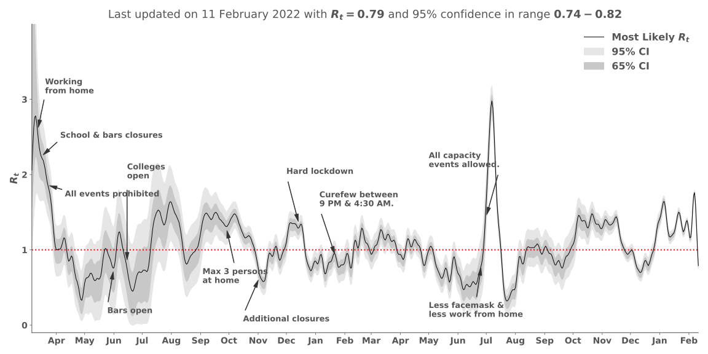
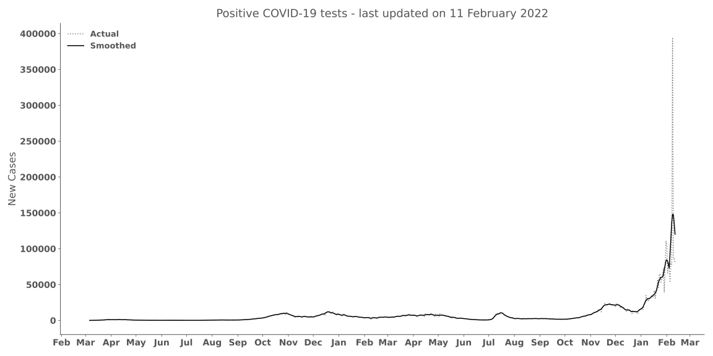

# Real-time Effective Reproduction Number

> Graphs are updates daily

This repository contains the code for downloading, processing, and model COVID-19 data for the Netherlands. This simple Bayesian model estimates the real-time effective reproduction number $R_t$ based on new case counts. All credit for developing this model goes to Systrom $^{1}$. He did all the hard work. I simply applied his insights, research, and model to estimate $R_t$ in real-time in the Netherlands. The national COVID-19 data is gathered by CoronaWatchNL$^{2}$ based on the raw data provided by the RIVM.

## Estimating $R_t$ in real-time

The plot below displays an estimate of the effective reproduction number $R_t$ in real-time in the Netherlands. The reproduction number estimates the number of people infected by one contagious person.

Systrom$^1$ applied a gaussian filter to the new case time series because of the stochastic nature of reporting due to for example backlogs or corrections. The filter is an arbitrary choice, but the real-world process is not nearly as stochastic as the actual reporting, smoothing helps with this.

## New COVID-19 cases

The plot below displays the daily COVID-19 case count for the Netherlands. The smoothed daily case count is used as input for the model.

## Refences

$^{1}$ Systrom, K. (2020). covid-19, GitHub repository, [https://github.com/k-sys/covid-19](https://github.com/k-sys/covid-19)
$^{2}$ De Bruin, J. (2020). Number of diagnoses with coronavirus disease (COVID-19) in The Netherlands (Version v2020.3.15) [Reported case counts by date in NL]. Zenodo. [http://doi.org/10.5281/zenodo.3711575](http://doi.org/10.5281/zenodo.3711575)
